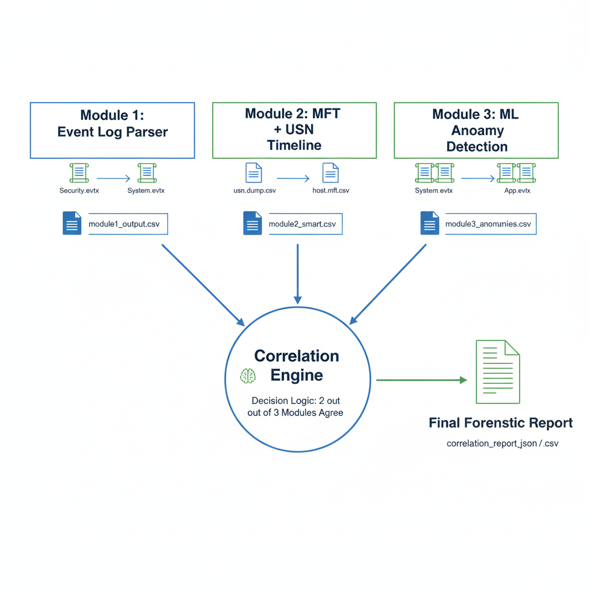
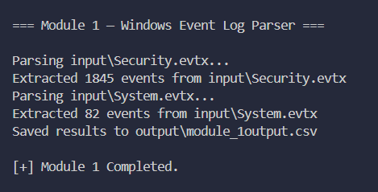
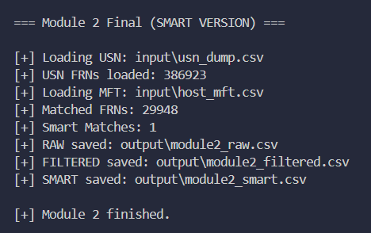
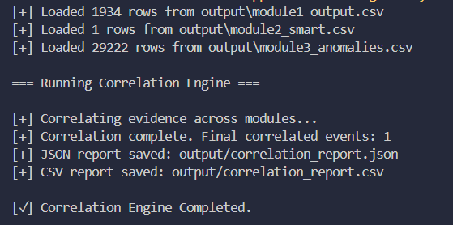

# Detecting Anti-Forensics in Windows Systems

This project is a forensic analysis tool designed to **detect anti-forensic activities** on Windows systems by correlating evidence from **event logs**, **file system metadata**, and **behavioral anomalies**.

The system follows a **modular pipeline** consisting of three independent analysis modules and a final **correlation engine** that combines their findings to produce high-confidence results.

---

## Tool Overview

The goal of this tool is to identify attempts to hide malicious activity, such as:

- Log clearing
- Timestamp manipulation (timestomping)
- Unusual behavioral patterns over time

Each module analyzes a **different forensic artifact**, ensuring that bypassing one layer does not evade detection.

---

## Architecture

---

## Module 1 — Windows Event Log Analysis

### Purpose
Identify **explicitly suspicious actions** recorded in Windows Event Logs using rule-based detection.

### Input
- `input/Security.evtx`
- `input/System.evtx`

### Method
- Parses EVTX files
- Filters events using known high-risk Event IDs (e.g. log clearing, time change, privilege escalation, process creation)

### Output
- `output/module1_output.csv`

---

## Module 2 — NTFS Timestamp Inconsistency Detection

### Purpose
Detect **timestomping and file metadata manipulation** by comparing NTFS timestamps against journaled file activity.

### Input
- `$MFT` parsed via MFTECmd (CSV)
- `$UsnJrnl:$J` parsed to CSV

### Method
- File Reference Number (FRN) correlation
- Timestamp comparison between MFT and USN
- Smart filtering to remove normal system noise

### Outputs
- `output/module2_raw.csv` — all timestamp mismatches  
- `output/module2_filtered.csv` — basic suspicious mismatches  
- `output/module2_smart.csv` — high-confidence timestomp detections

---

## Module 3 — Behavioral Anomaly Detection

### Purpose
Detect **statistical anomalies** in system behavior that may indicate stealthy or unknown attacks.

### Input
- `input/module3_all_events.csv`  
  (Comprehensive event export from EVTX logs)

### Method
- Sliding time-window feature extraction
- Event frequency modeling
- Isolation Forest for anomaly detection

### Outputs
- `output/module3_features.csv`
- `output/module3_anomalies.csv`

---

## Correlation Engine

### Purpose
Combine evidence from multiple modules to generate **high-confidence forensic alerts**.

### Inputs
- `output/module1_output.csv`
- `output/module2_smart.csv`
- `output/module3_anomalies.csv`

### Correlation Logic
An event is considered valid only when **two or more independent modules corroborate the same activity** within a related time window.

### Output
- Final correlated report (CSV / JSON)
- No report is generated if no corroborated evidence exists

---

---

## Conclusion

This tool demonstrates that **anti-forensic activity cannot reliably hide across all forensic layers**.  
By correlating logs, file system artifacts, and behavior, the system reduces false positives while maintaining strong detection coverage.
